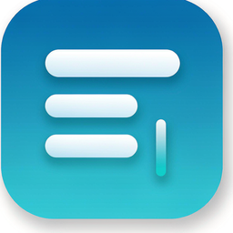

# LightInk 轻墨

<p align="center">
  
</p>

**本地 Markdown 编辑器 + 阅读器** · 所见即所得 · 自动保存 · 离线可用，数据不出本机。

   

## 特性

- **三种模式**：阅读（默认打开即读）→ 编辑（所见即所得）→ 源码，一键切换
- **书架管理**：自定义分类文件夹（新建/重命名/删除），文件可自由加入/移除
- **新建文档**：应用内创建 Markdown，关闭时引导保存命名
- **txt 支持**：`.md` / `.markdown` / `.txt` 全部关联打开
- **自动保存**：停止输入 0.9 秒自动写回原文件，`Ctrl+S` 随时可用
- **阅读位置记忆**：每个文件的滚动位置都会被记住，重开自动回到原处
- **文内查找**：`Ctrl+F`，CSS Custom Highlight API 高亮，不打断排版
- **导出**：HTML（自包含单文件，KaTeX 字体与图片全内联）/ PDF（A4）
- **书架与最近文件**：固定文库目录 + 最近 12 条记录，启动自动恢复
- **中文排版优先**：字号 / 行距 / 版心可调，限宽版心
- **完整语法**：GFM 全要素 + KaTeX 数学公式 + Mermaid 图表 + 代码高亮
- **毛玻璃 UI**：亮 / 暗 / 跟随系统三态主题，编辑模式淡灰底色区分

## 安装

从 [Releases](../../releases) 下载 `LightInk-Setup-1.0.0.exe` 双击安装（无需管理员权限）。安装后双击任意 `.md` 文件即可打开。

> 安装包未做数字签名，SmartScreen 提示时选「更多信息 → 仍要运行」。

## 开发

```bash
git clone https://github.com/<user>/lightink.git
cd lightink/app
npm install          # 国内网络已配置 .npmrc 走 npmmirror
npm run dev          # 开发运行
npm run dist         # 打包 NSIS 安装包
```

编辑器渲染依赖已 vendored（`app/renderer/vendor/`），克隆即可离线运行；如需重新生成：

```bash
cd vendor-src && npm install && npx esbuild node_modules/@milkdown/crepe/lib/esm/index.js --bundle --format=esm --platform=browser --outfile=../app/renderer/vendor/crepe.bundle.mjs
```

## 目录结构

```
app/                  Electron 应用（主进程 / preload / renderer）
  build/              图标资源与生成脚本（gen-icon.cjs）
  renderer/           UI（单 HTML，Milkdown Crepe vendored）
vendor-src/           依赖源码打包（esbuild）
prototype/            早期交互原型与 UI 设计稿
tools/                CDP 实测脚本（无头 Edge/CEP 探针）与构建工具
PRD-MD阅读器.md       产品需求文档（16 项决议归档）
```

## License

MIT
